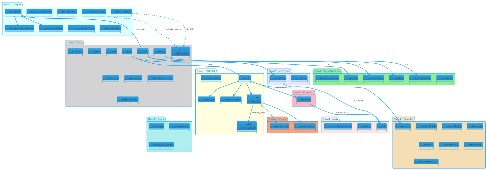

# DATA_MODEL Addendum — Phase P (App 端 + 运营 36 张新表)

> 日期：2026-05-04
> 范围：`docs/APP_BACKEND_PLAN.md` Phase 0 / A / K / D / RP / M / N / E / O 引入的全部新表与扩列。
> 本 addendum 与现有 `docs/DATA_MODEL.md` 互补，最终合入主文档。

## 总览

| 来源 Phase | 表数 | 备注 |
| --- | --- | --- |
| 0 多租户基础 | 6 | App 端用户 → Project → 监测的归属链 |
| A Analyzer 收尾 | 9 | + `citation_sources` 4 列 ALTER |
| K Knowledge Graph | 6 | 5 张 `kg_*` + 1 张 candidates staging |
| D Diagnostics | 1 | + 25+ 规则 row（数据非 schema） |
| RP Reports | 2 | + `report_jobs` 6 列 ALTER |
| M MCP + Team | 2 | + `users` 1 列 + `projects` 1 列 |
| N Alerts | 3 | |
| E Exports + Submissions | 2 | + `industry_pricing_params` 行业参数表 |
| O Admin Operations | 7 | + `commercial_leads` 4 列 ALTER + `budget_thresholds` |
| **总计** | **38 张新表 + 16 列 ALTER** | |

ER 图（PlantUML）见 §EER 节末。

---

## Phase 0 — 多租户基础（6）

```sql
CREATE TABLE projects (
  id UUID PRIMARY KEY DEFAULT gen_random_uuid(),
  user_id INT NOT NULL REFERENCES users(id) ON DELETE CASCADE,
  org_id UUID,                                            -- Phase M 后启用
  name VARCHAR(120) NOT NULL,
  industry_id INT REFERENCES industries(id) ON DELETE SET NULL,
  primary_brand_id INT REFERENCES brands(id) ON DELETE SET NULL,
  is_active BOOLEAN NOT NULL DEFAULT TRUE,
  preferred_engines TEXT[],                               -- ['chatgpt', 'doubao', 'deepseek']
  default_profile_group_id VARCHAR(64),
  preferences JSONB,                                      -- 时间窗口 / 默认筛选 / 报告调度等
  created_at TIMESTAMPTZ DEFAULT now(),
  updated_at TIMESTAMPTZ DEFAULT now(),
  deleted_at TIMESTAMPTZ,
  UNIQUE (user_id, name)
);
CREATE INDEX projects_user_active_idx ON projects (user_id, is_active, created_at DESC);
CREATE INDEX projects_org_idx ON projects (org_id) WHERE org_id IS NOT NULL;

CREATE TABLE project_competitors (
  project_id UUID NOT NULL REFERENCES projects(id) ON DELETE CASCADE,
  brand_id INT NOT NULL REFERENCES brands(id) ON DELETE RESTRICT,
  pinned_at TIMESTAMPTZ DEFAULT now(),
  pinned_by INT REFERENCES users(id),
  PRIMARY KEY (project_id, brand_id)
);
-- capacity 10/project 在 service 层校验

CREATE TABLE project_topic_pins (
  project_id UUID NOT NULL REFERENCES projects(id) ON DELETE CASCADE,
  topic_id BIGINT NOT NULL,                               -- FK → topics(id)
  state VARCHAR(16) NOT NULL CHECK (state IN ('tracked', 'ignored')),
  pinned_at TIMESTAMPTZ DEFAULT now(),
  PRIMARY KEY (project_id, topic_id)
);

CREATE TABLE commercial_leads (
  id UUID PRIMARY KEY DEFAULT gen_random_uuid(),
  user_id INT REFERENCES users(id) ON DELETE SET NULL,
  org_id UUID,
  project_id UUID REFERENCES projects(id) ON DELETE SET NULL,
  source VARCHAR(64) NOT NULL,                            -- 'diagnostics' | 'simulator' | 'cta_modal' | 'brand_submission'
  context JSONB,                                          -- contact info / concerns / brand / etc.
  status VARCHAR(16) DEFAULT 'new' CHECK (status IN ('new', 'contacted', 'closed', 'ignored')),
  created_at TIMESTAMPTZ DEFAULT now()
  -- 后续 Phase O 加 assigned_to / closed_reason / consultation_notes / report_pdf_url
);
CREATE INDEX commercial_leads_status_idx ON commercial_leads (status, created_at DESC);

CREATE TABLE report_jobs (
  id UUID PRIMARY KEY DEFAULT gen_random_uuid(),
  project_id UUID NOT NULL REFERENCES projects(id) ON DELETE CASCADE,
  type VARCHAR(16) NOT NULL CHECK (type IN ('pdf', 'csv', 'markdown', 'json')),
  scope JSONB NOT NULL,
  status VARCHAR(16) NOT NULL DEFAULT 'queued' CHECK (status IN ('queued', 'running', 'done', 'failed', 'cancelled')),
  output_url TEXT,
  error TEXT,
  scheduled_cron VARCHAR(64),
  created_by INT REFERENCES users(id),
  created_at TIMESTAMPTZ DEFAULT now(),
  finished_at TIMESTAMPTZ
  -- Phase RP 加 6 列：report_type / section_config / locale / narrative_data / markdown_url / json_url
);
CREATE INDEX report_jobs_project_status_idx ON report_jobs (project_id, status, created_at DESC);

CREATE TABLE crawl_requests (
  id UUID PRIMARY KEY DEFAULT gen_random_uuid(),
  project_id UUID NOT NULL REFERENCES projects(id) ON DELETE CASCADE,
  brand_id INT REFERENCES brands(id),
  scope JSONB,                                            -- {engines: [...], prompts: [...]}
  status VARCHAR(16) NOT NULL DEFAULT 'queued' CHECK (status IN ('queued', 'running', 'done', 'failed')),
  attempts INT DEFAULT 0,
  result_summary JSONB,
  created_by INT REFERENCES users(id),
  created_at TIMESTAMPTZ DEFAULT now(),
  finished_at TIMESTAMPTZ
);
CREATE INDEX crawl_requests_project_status_idx ON crawl_requests (project_id, status, created_at DESC);
CREATE INDEX crawl_requests_user_daily_idx ON crawl_requests (created_by, date_trunc('day', created_at));
-- 用户日上限校验用
```

---

## Phase A — Analyzer 收尾（9 表 + 4 列 ALTER）

### 列扩

```sql
ALTER TABLE citation_sources
  ADD COLUMN attribution_method VARCHAR(32),              -- official_site|official_mention|co_occurrence|text_match|unattributed
  ADD COLUMN authority_tier SMALLINT,                     -- 0|1|2|3|4
  ADD COLUMN site_type VARCHAR(32),                       -- review|ranking|kol|wiki|product|news|other
  ADD COLUMN page_type VARCHAR(32);                       -- review|ranking|kol_blog|wiki|news_article|product_page|forum|comparison|how_to|case_study|other
CREATE INDEX citation_sources_brand_method_idx ON citation_sources (mention_id, attribution_method, created_at DESC);
CREATE INDEX citation_sources_tier_idx ON citation_sources (authority_tier, created_at DESC) WHERE authority_tier IS NOT NULL;

ALTER TABLE llm_responses ADD COLUMN analyzer_version VARCHAR(16);
```

### 新表

```sql
CREATE TABLE brand_official_domains (
  brand_id INT NOT NULL REFERENCES brands(id) ON DELETE CASCADE,
  domain VARCHAR(256) NOT NULL,
  is_primary BOOLEAN DEFAULT FALSE,
  created_at TIMESTAMPTZ DEFAULT now(),
  PRIMARY KEY (brand_id, domain)
);
CREATE INDEX brand_official_domains_domain_idx ON brand_official_domains (domain);

CREATE TABLE domain_authorities (
  domain VARCHAR(256) PRIMARY KEY,
  tier SMALLINT NOT NULL CHECK (tier BETWEEN 0 AND 4),
  confidence FLOAT DEFAULT 1.0,
  site_type VARCHAR(32),
  notes TEXT,
  reviewed_by INT REFERENCES users(id),
  reviewed_at TIMESTAMPTZ,
  created_at TIMESTAMPTZ DEFAULT now(),
  updated_at TIMESTAMPTZ DEFAULT now()
);
CREATE INDEX domain_authorities_tier_idx ON domain_authorities (tier);

CREATE TABLE brand_groups (
  id SERIAL PRIMARY KEY,
  name VARCHAR(256) NOT NULL,
  parent_company VARCHAR(256),
  notes TEXT,
  created_at TIMESTAMPTZ DEFAULT now()
);

CREATE TABLE brand_group_members (
  group_id INT NOT NULL REFERENCES brand_groups(id) ON DELETE CASCADE,
  brand_id INT NOT NULL REFERENCES brands(id) ON DELETE CASCADE,
  role VARCHAR(32),                                       -- 'flagship'|'sister'|'sub'
  joined_at TIMESTAMPTZ DEFAULT now(),
  PRIMARY KEY (group_id, brand_id)
);
CREATE INDEX brand_group_members_brand_idx ON brand_group_members (brand_id);

CREATE TABLE brand_group_shared_domains (
  group_id INT NOT NULL REFERENCES brand_groups(id) ON DELETE CASCADE,
  domain VARCHAR(256) NOT NULL,
  brand_count INT NOT NULL,                               -- 该域同时引用 group 内几个品牌
  total_mentions INT NOT NULL,
  last_seen_at TIMESTAMPTZ,
  PRIMARY KEY (group_id, domain)
);

CREATE TABLE competitor_mention_daily (
  brand_id INT NOT NULL REFERENCES brands(id),
  competitor_id INT NOT NULL REFERENCES brands(id),
  date DATE NOT NULL,
  target_llm VARCHAR(64),
  co_mention_count INT DEFAULT 0,
  my_mention_count INT DEFAULT 0,
  comp_mention_count INT DEFAULT 0,
  avg_sentiment_diff FLOAT,                               -- my - comp
  sov_diff FLOAT,
  PRIMARY KEY (brand_id, competitor_id, date, target_llm)
);
CREATE INDEX competitor_mention_daily_pair_date_idx ON competitor_mention_daily (brand_id, competitor_id, date DESC);

CREATE TABLE geo_score_weekly (
  brand_id INT NOT NULL REFERENCES brands(id),
  week_start DATE NOT NULL,
  target_llm VARCHAR(64),
  avg_geo_score FLOAT,
  avg_authority_tier FLOAT,
  top_authority_domains_json JSONB,                       -- [{domain, tier, count}, ...]
  tier1_citation_count INT DEFAULT 0,
  tier2_citation_count INT DEFAULT 0,
  tier3_citation_count INT DEFAULT 0,
  tier4_citation_count INT DEFAULT 0,
  PRIMARY KEY (brand_id, week_start, target_llm)
);

CREATE TABLE citation_weekly_by_domain (
  brand_id INT NOT NULL REFERENCES brands(id),
  domain VARCHAR(256) NOT NULL,
  week_start DATE NOT NULL,
  citation_count INT DEFAULT 0,
  avg_position_rank FLOAT,
  PRIMARY KEY (brand_id, domain, week_start)
);
CREATE INDEX citation_weekly_by_domain_brand_week_idx ON citation_weekly_by_domain (brand_id, week_start DESC);

CREATE TABLE industry_topic_daily (
  industry_id INT NOT NULL REFERENCES industries(id),
  category VARCHAR(128),
  topic_id BIGINT,
  date DATE NOT NULL,
  mention_count INT DEFAULT 0,
  unique_brand_count INT DEFAULT 0,
  hot_score FLOAT,
  PRIMARY KEY (industry_id, COALESCE(category, ''), COALESCE(topic_id, 0), date)
);
CREATE INDEX industry_topic_daily_industry_date_idx ON industry_topic_daily (industry_id, date DESC);
```

---

## Phase K — Knowledge Graph（6 表）

```sql
CREATE TABLE kg_categories (
  id BIGSERIAL PRIMARY KEY,
  industry_id INT REFERENCES industries(id),
  parent_id BIGINT REFERENCES kg_categories(id) ON DELETE SET NULL,
  name_zh VARCHAR(128) NOT NULL,
  name_en VARCHAR(128),
  level SMALLINT,
  slug VARCHAR(64),
  status VARCHAR(16) DEFAULT 'approved' CHECK (status IN ('approved', 'unverified', 'rejected')),
  created_at TIMESTAMPTZ DEFAULT now(),
  UNIQUE (industry_id, parent_id, slug)
);
CREATE INDEX kg_categories_industry_level_idx ON kg_categories (industry_id, level);

CREATE TABLE kg_brands (
  id BIGSERIAL PRIMARY KEY,
  brand_id INT NOT NULL UNIQUE REFERENCES brands(id) ON DELETE CASCADE,
  industry_id INT REFERENCES industries(id),
  primary_name VARCHAR(256) NOT NULL,
  name_zh VARCHAR(256), name_en VARCHAR(256),
  aliases JSONB,
  official_domains JSONB,                                 -- 镜像 brand_official_domains 便于 KG 查询
  group_id INT REFERENCES brand_groups(id),
  status VARCHAR(16) DEFAULT 'approved' CHECK (status IN ('pending', 'approved', 'rejected')),
  created_at TIMESTAMPTZ DEFAULT now(),
  updated_at TIMESTAMPTZ DEFAULT now()
);

CREATE TABLE kg_products (
  id BIGSERIAL PRIMARY KEY,
  product_id INT NOT NULL UNIQUE REFERENCES products(id) ON DELETE CASCADE,
  brand_id INT NOT NULL REFERENCES brands(id),
  category_id BIGINT REFERENCES kg_categories(id),
  primary_name VARCHAR(256) NOT NULL,
  name_zh VARCHAR(256), name_en VARCHAR(256),
  aliases JSONB,
  status VARCHAR(16) DEFAULT 'approved' CHECK (status IN ('pending', 'approved', 'rejected')),
  created_at TIMESTAMPTZ DEFAULT now(),
  updated_at TIMESTAMPTZ DEFAULT now()
);

CREATE TABLE kg_brand_relations (
  id UUID PRIMARY KEY DEFAULT gen_random_uuid(),
  brand_a_id INT NOT NULL REFERENCES brands(id) ON DELETE CASCADE,
  brand_b_id INT NOT NULL REFERENCES brands(id) ON DELETE CASCADE,
  type VARCHAR(32) NOT NULL CHECK (type IN ('COMPETES_WITH', 'SAME_GROUP')),
  confidence FLOAT NOT NULL CHECK (confidence BETWEEN 0 AND 1),
  source VARCHAR(32) NOT NULL CHECK (source IN ('analyzer', 'admin', 'import')),
  evidence JSONB,                                         -- {response_ids: [...], snippets: [...]}
  reviewed_by INT, reviewed_at TIMESTAMPTZ,
  created_at TIMESTAMPTZ DEFAULT now(),
  UNIQUE (brand_a_id, brand_b_id, type),
  CHECK (brand_a_id < brand_b_id)                         -- 防止双向重复
);

CREATE TABLE kg_product_relations (
  id UUID PRIMARY KEY DEFAULT gen_random_uuid(),
  product_a_id INT NOT NULL REFERENCES products(id) ON DELETE CASCADE,
  product_b_id INT NOT NULL REFERENCES products(id) ON DELETE CASCADE,
  type VARCHAR(32) NOT NULL CHECK (type IN ('COMPETES_WITH', 'SUBSTITUTES', 'UPGRADES_TO', 'BUDGET_ALT_OF', 'PAIRS_WITH')),
  confidence FLOAT, source VARCHAR(32), evidence JSONB,
  reviewed_by INT, reviewed_at TIMESTAMPTZ,
  created_at TIMESTAMPTZ DEFAULT now(),
  UNIQUE (product_a_id, product_b_id, type)
);

CREATE TABLE kg_relation_candidates (
  id UUID PRIMARY KEY DEFAULT gen_random_uuid(),
  entity_kind VARCHAR(8) NOT NULL CHECK (entity_kind IN ('brand', 'product')),
  a_id INT NOT NULL,
  b_id INT NOT NULL,
  type VARCHAR(32) NOT NULL,
  confidence FLOAT,
  evidence JSONB,
  status VARCHAR(16) DEFAULT 'pending' CHECK (status IN ('pending', 'approved', 'rejected', 'merged')),
  llm_model VARCHAR(64),
  reviewed_by INT, reviewed_at TIMESTAMPTZ,
  merged_into_relation_id UUID,
  created_at TIMESTAMPTZ DEFAULT now()
);
CREATE INDEX kg_relation_candidates_status_idx ON kg_relation_candidates (status, created_at DESC);
```

---

## Phase D — Diagnostics（1 表）

```sql
CREATE TABLE diagnostics (
  id UUID PRIMARY KEY DEFAULT gen_random_uuid(),
  project_id UUID NOT NULL REFERENCES projects(id) ON DELETE CASCADE,
  brand_id INT REFERENCES brands(id),
  product_id INT REFERENCES products(id),
  industry_id INT REFERENCES industries(id),
  category VARCHAR(64) NOT NULL,                          -- 见 PRD §4.7.1.1
  severity VARCHAR(4) NOT NULL CHECK (severity IN ('P0', 'P1', 'P2', 'P3')),
  type VARCHAR(16) NOT NULL CHECK (type IN ('brand', 'product', 'industry')),
  title VARCHAR(512) NOT NULL,
  description TEXT,
  engine VARCHAR(32),
  focus_area VARCHAR(256),
  direction TEXT,
  reader_hints TEXT[] NOT NULL,
  decision_prompt TEXT,
  evidence JSONB NOT NULL,
  causal_chain JSONB,
  industry_benchmark JSONB,
  time_series JSONB,
  anchor_questions JSONB,
  if_untreated TEXT,
  status VARCHAR(16) DEFAULT 'open' CHECK (status IN ('open', 'acknowledged', 'ignored', 'resolved')),
  detected_at TIMESTAMPTZ DEFAULT now(),
  acknowledged_at TIMESTAMPTZ, acknowledged_by INT,
  resolved_at TIMESTAMPTZ, resolved_by INT,
  rule_id VARCHAR(64) NOT NULL,
  rule_version VARCHAR(16),
  alert_id UUID
);
CREATE INDEX diagnostics_project_status_idx ON diagnostics (project_id, severity, status, detected_at DESC);
CREATE INDEX diagnostics_brand_category_idx ON diagnostics (project_id, brand_id, category);
CREATE INDEX diagnostics_rule_idx ON diagnostics (rule_id, detected_at DESC);
```

---

## Phase RP — Reports 扩列 + 2 张新表

```sql
ALTER TABLE report_jobs
  ADD COLUMN report_type VARCHAR(32) CHECK (report_type IN ('weekly', 'monthly', 'on_demand', 'lead_diagnostic')),
  ADD COLUMN section_config JSONB,
  ADD COLUMN locale VARCHAR(8) DEFAULT 'zh-CN',
  ADD COLUMN narrative_data JSONB,
  ADD COLUMN markdown_url TEXT,
  ADD COLUMN json_url TEXT;

CREATE TABLE report_schedules (
  id UUID PRIMARY KEY DEFAULT gen_random_uuid(),
  project_id UUID NOT NULL REFERENCES projects(id) ON DELETE CASCADE,
  report_type VARCHAR(32) NOT NULL,
  cron VARCHAR(64) NOT NULL,
  recipients TEXT[],
  enabled BOOLEAN DEFAULT TRUE,
  next_run_at TIMESTAMPTZ,
  last_run_at TIMESTAMPTZ,
  last_run_id UUID REFERENCES report_jobs(id),
  locale VARCHAR(8) DEFAULT 'zh-CN',
  created_at TIMESTAMPTZ DEFAULT now(),
  updated_at TIMESTAMPTZ DEFAULT now()
);
CREATE INDEX report_schedules_next_run_idx ON report_schedules (next_run_at) WHERE enabled = TRUE;

CREATE TABLE report_share_tokens (
  token VARCHAR(64) PRIMARY KEY,
  report_id UUID NOT NULL REFERENCES report_jobs(id) ON DELETE CASCADE,
  expires_at TIMESTAMPTZ NOT NULL,
  view_count INT DEFAULT 0,
  created_by INT REFERENCES users(id),
  created_at TIMESTAMPTZ DEFAULT now(),
  revoked_at TIMESTAMPTZ
);
```

---

## Phase M — MCP + Team 预留位（2 表 + 列扩）

```sql
CREATE TABLE organizations (
  id UUID PRIMARY KEY DEFAULT gen_random_uuid(),
  name VARCHAR(120) NOT NULL,
  slug VARCHAR(64) UNIQUE,
  plan VARCHAR(16) DEFAULT 'free' CHECK (plan IN ('free', 'pro', 'enterprise')),
  created_at TIMESTAMPTZ DEFAULT now()
);

CREATE TABLE user_api_keys (
  id UUID PRIMARY KEY DEFAULT gen_random_uuid(),
  user_id INT NOT NULL REFERENCES users(id) ON DELETE CASCADE,
  org_id UUID REFERENCES organizations(id),
  name VARCHAR(64),
  hash VARCHAR(128) NOT NULL,                             -- bcrypt
  prefix VARCHAR(16) NOT NULL,                            -- 前 8 字符明文，gp_sk_xxx
  scope JSONB DEFAULT '{}',
  last_used_at TIMESTAMPTZ,
  usage_count INT DEFAULT 0,
  rate_limit_per_minute INT DEFAULT 60,
  expires_at TIMESTAMPTZ,
  created_at TIMESTAMPTZ DEFAULT now(),
  revoked_at TIMESTAMPTZ
);
CREATE INDEX user_api_keys_user_idx ON user_api_keys (user_id, revoked_at);
CREATE UNIQUE INDEX user_api_keys_prefix_idx ON user_api_keys (prefix) WHERE revoked_at IS NULL;

ALTER TABLE users ADD COLUMN default_org_id UUID REFERENCES organizations(id);
ALTER TABLE projects ADD COLUMN org_id_check UUID;        -- 重命名时迁移用占位
-- migration: 每用户建 personal org，所有 project / lead / report 落到该 org
```

---

## Phase N — Alerts + Notifications（3 表）

```sql
CREATE TABLE alerts (
  id UUID PRIMARY KEY DEFAULT gen_random_uuid(),
  project_id UUID REFERENCES projects(id) ON DELETE CASCADE,
  brand_id INT REFERENCES brands(id),
  source VARCHAR(32) NOT NULL,                            -- 见 PRD §4.7.3.1
  source_ref_id VARCHAR(64),                              -- diagnostic.id / engine_health 行 / 等
  severity VARCHAR(4) NOT NULL CHECK (severity IN ('P0', 'P1', 'P2', 'P3')),
  scope VARCHAR(16) NOT NULL DEFAULT 'user' CHECK (scope IN ('user', 'operator')),
  title VARCHAR(512) NOT NULL,
  body TEXT,
  status VARCHAR(16) DEFAULT 'unread' CHECK (status IN ('unread', 'read', 'ignored', 'resolved')),
  triggered_at TIMESTAMPTZ DEFAULT now(),
  read_at TIMESTAMPTZ, read_by INT,
  resolved_at TIMESTAMPTZ,
  assigned_to INT,                                        -- operator scope 用
  runbook_url TEXT
);
CREATE INDEX alerts_scope_status_idx ON alerts (scope, status, triggered_at DESC);
CREATE INDEX alerts_project_idx ON alerts (project_id, triggered_at DESC) WHERE scope = 'user';
CREATE INDEX alerts_source_ref_idx ON alerts (source, source_ref_id);

CREATE TABLE alert_rules (
  id UUID PRIMARY KEY DEFAULT gen_random_uuid(),
  user_id INT REFERENCES users(id) ON DELETE CASCADE,
  project_id UUID REFERENCES projects(id) ON DELETE CASCADE,
  rule_type VARCHAR(32) NOT NULL,                         -- 'p0_diagnostic'|'p1_diagnostic'|'citation_mismatch'|'competitor_overtake'|'weekly_digest'
  conditions JSONB,
  channels TEXT[] DEFAULT ARRAY['email', 'inapp'],
  enabled BOOLEAN DEFAULT TRUE,
  created_at TIMESTAMPTZ DEFAULT now()
);

CREATE TABLE user_notification_preferences (
  user_id INT PRIMARY KEY REFERENCES users(id) ON DELETE CASCADE,
  p0p1_alerts BOOLEAN DEFAULT TRUE,
  weekly_report BOOLEAN DEFAULT TRUE,
  competitor_alert BOOLEAN DEFAULT FALSE,
  email_locale VARCHAR(8) DEFAULT 'zh-CN',
  quiet_hours JSONB,                                      -- {start, end, tz}
  channels TEXT[] DEFAULT ARRAY['email', 'inapp'],
  updated_at TIMESTAMPTZ DEFAULT now()
);
```

---

## Phase E — Exports + Submissions + Pricing（3 表）

```sql
CREATE TABLE export_jobs (
  id UUID PRIMARY KEY DEFAULT gen_random_uuid(),
  project_id UUID NOT NULL REFERENCES projects(id) ON DELETE CASCADE,
  user_id INT NOT NULL REFERENCES users(id),
  export_type VARCHAR(32) NOT NULL,                       -- 见 PRD §4.7.4.1
  scope JSONB,
  status VARCHAR(16) DEFAULT 'queued' CHECK (status IN ('queued', 'running', 'done', 'failed')),
  output_url TEXT,
  row_count INT,
  error TEXT,
  created_at TIMESTAMPTZ DEFAULT now(),
  finished_at TIMESTAMPTZ
);
CREATE INDEX export_jobs_user_daily_idx ON export_jobs (user_id, date_trunc('day', created_at));

CREATE TABLE brand_submissions (
  id UUID PRIMARY KEY DEFAULT gen_random_uuid(),
  user_id INT NOT NULL REFERENCES users(id),
  org_id UUID,
  proposed_name VARCHAR(256) NOT NULL,
  proposed_industry_id INT REFERENCES industries(id),
  proposed_aliases JSONB,
  proposed_official_domains JSONB,
  notes TEXT,
  source_url TEXT,
  status VARCHAR(16) DEFAULT 'pending' CHECK (status IN ('pending', 'approved', 'rejected', 'duplicate')),
  reviewer_id INT REFERENCES users(id),
  reviewed_at TIMESTAMPTZ,
  rejection_reason TEXT,
  resulting_brand_id INT REFERENCES brands(id),
  created_at TIMESTAMPTZ DEFAULT now()
);
CREATE INDEX brand_submissions_status_idx ON brand_submissions (status, created_at DESC);

CREATE TABLE industry_pricing_params (
  industry_id INT PRIMARY KEY REFERENCES industries(id),
  tier1_unit_price_cny NUMERIC(10,2),
  tier2_unit_price_cny NUMERIC(10,2),
  tier3_unit_price_cny NUMERIC(10,2),
  tier4_unit_price_cny NUMERIC(10,2),
  updated_at TIMESTAMPTZ DEFAULT now(),
  updated_by INT REFERENCES users(id)
);
```

---

## Phase O — Admin Operations（7 表 + 列扩）

```sql
ALTER TABLE commercial_leads
  ADD COLUMN assigned_to INT REFERENCES users(id),
  ADD COLUMN closed_reason VARCHAR(64),
  ADD COLUMN consultation_notes TEXT,
  ADD COLUMN report_pdf_url TEXT;

CREATE TABLE engine_health_daily (
  id SERIAL PRIMARY KEY,
  engine VARCHAR(64) NOT NULL,
  date DATE NOT NULL,
  total_attempts INT DEFAULT 0,
  success_count INT DEFAULT 0,
  failed_count INT DEFAULT 0,
  success_rate FLOAT DEFAULT 0,
  p50_latency_ms INT, p95_latency_ms INT,
  cookie_status VARCHAR(16),
  captcha_count INT DEFAULT 0,
  ip_blocked_count INT DEFAULT 0,
  rate_limited_count INT DEFAULT 0,
  last_updated TIMESTAMPTZ DEFAULT now(),
  UNIQUE (engine, date)
);
CREATE INDEX engine_health_daily_engine_idx ON engine_health_daily (engine, date DESC);

CREATE TABLE proxy_health_daily (
  id SERIAL PRIMARY KEY,
  proxy_id INT NOT NULL,
  date DATE NOT NULL,
  total_requests INT DEFAULT 0,
  success_count INT DEFAULT 0,
  success_rate FLOAT,
  avg_latency_ms INT,
  is_blocked BOOLEAN DEFAULT FALSE,
  notes TEXT,
  UNIQUE (proxy_id, date)
);

CREATE TABLE discovery_log (
  id UUID PRIMARY KEY DEFAULT gen_random_uuid(),
  source VARCHAR(32) NOT NULL,                            -- 'relation_extractor'|'brand_detector'|'category_classifier'
  candidate_id UUID,
  llm_model VARCHAR(64),
  confidence FLOAT,
  hallucination_flag BOOLEAN DEFAULT FALSE,
  hallucination_evidence JSONB,
  occurred_at TIMESTAMPTZ DEFAULT now()
);
CREATE INDEX discovery_log_source_time_idx ON discovery_log (source, occurred_at DESC);
CREATE INDEX discovery_log_hallucination_idx ON discovery_log (hallucination_flag, occurred_at DESC);

CREATE TABLE cost_events (
  id UUID PRIMARY KEY DEFAULT gen_random_uuid(),
  scope VARCHAR(16) NOT NULL CHECK (scope IN ('pipeline', 'kg', 'mcp', 'reports')),
  amount NUMERIC(10,4) NOT NULL,
  source VARCHAR(64) NOT NULL,
  event_type VARCHAR(32) NOT NULL,
  reference_id VARCHAR(64),
  metadata JSONB,
  occurred_at TIMESTAMPTZ DEFAULT now()
);
CREATE INDEX cost_events_scope_time_idx ON cost_events (scope, occurred_at DESC);
CREATE INDEX cost_events_source_time_idx ON cost_events (source, occurred_at DESC);

CREATE TABLE budget_thresholds (
  scope VARCHAR(16) PRIMARY KEY CHECK (scope IN ('pipeline', 'kg', 'mcp', 'reports')),
  daily_limit_cny NUMERIC(10,2),
  weekly_limit_cny NUMERIC(10,2),
  monthly_limit_cny NUMERIC(10,2),
  alert_at_pct INT DEFAULT 80,
  hard_stop_at_pct INT DEFAULT 100,
  updated_at TIMESTAMPTZ DEFAULT now()
);

CREATE TABLE admin_audit_log (
  id UUID PRIMARY KEY DEFAULT gen_random_uuid(),
  operator_id INT NOT NULL REFERENCES users(id),
  action VARCHAR(64) NOT NULL,
  resource_type VARCHAR(32) NOT NULL,
  resource_id VARCHAR(64),
  severity VARCHAR(8) NOT NULL CHECK (severity IN ('low', 'med', 'high')),
  before JSONB, after JSONB,
  ip INET, user_agent TEXT,
  reason TEXT,
  occurred_at TIMESTAMPTZ DEFAULT now()
);
CREATE INDEX admin_audit_log_operator_idx ON admin_audit_log (operator_id, occurred_at DESC);
CREATE INDEX admin_audit_log_action_severity_idx ON admin_audit_log (action, severity, occurred_at DESC);
CREATE INDEX admin_audit_log_resource_idx ON admin_audit_log (resource_type, resource_id);

CREATE TABLE mcp_call_log (
  id BIGSERIAL,
  api_key_id UUID REFERENCES user_api_keys(id) ON DELETE CASCADE,
  user_id INT REFERENCES users(id),
  tool VARCHAR(64),
  resource_uri VARCHAR(512),
  status VARCHAR(16) NOT NULL CHECK (status IN ('success', 'error')),
  http_status INT,
  error_code VARCHAR(64),
  latency_ms INT,
  cost_estimate_cny NUMERIC(10,4),
  request_size_bytes INT,
  response_size_bytes INT,
  occurred_at TIMESTAMPTZ DEFAULT now(),
  PRIMARY KEY (id, occurred_at)
) PARTITION BY RANGE (occurred_at);
-- 月度分区，PG16+ 支持自动分区；运维月初创建下个月 partition

CREATE TABLE comms_announcements (
  id UUID PRIMARY KEY DEFAULT gen_random_uuid(),
  title_zh VARCHAR(256), title_en VARCHAR(256),
  body_zh TEXT, body_en TEXT,
  channel VARCHAR(16) NOT NULL CHECK (channel IN ('inapp', 'email', 'both')),
  audience VARCHAR(64) NOT NULL,
  scheduled_at TIMESTAMPTZ,
  sent_at TIMESTAMPTZ,
  sent_count INT DEFAULT 0,
  status VARCHAR(16) DEFAULT 'draft' CHECK (status IN ('draft', 'scheduled', 'sending', 'sent', 'cancelled')),
  created_by INT REFERENCES users(id),
  created_at TIMESTAMPTZ DEFAULT now(),
  updated_at TIMESTAMPTZ DEFAULT now()
);
```

---

## ER 图（PlantUML）



---

## 索引摘要（性能关键）

| 表 | 关键索引 |
| --- | --- |
| projects | `(user_id, is_active, created_at DESC)` |
| diagnostics | `(project_id, severity, status, detected_at DESC)` |
| alerts | `(scope, status, triggered_at DESC)` |
| citation_sources（扩列后）| `(mention_id, attribution_method, created_at DESC)` |
| competitor_mention_daily | `(brand_id, competitor_id, date DESC)` |
| cost_events | `(scope, occurred_at DESC)` |
| admin_audit_log | `(operator_id, occurred_at DESC)`, `(action, severity, occurred_at DESC)` |
| mcp_call_log | partition by month + `(api_key_id, occurred_at DESC)` |
| user_api_keys | `(prefix)` UNIQUE WHERE revoked_at IS NULL |

---

## Migration Order

```
1. Phase 0     6 表
2. Phase A     9 表 + citation_sources/llm_responses 列扩
3. Phase K     6 表（FK 依赖 Phase 0 brands/products）
4. Phase D     1 表（FK 依赖 projects + brands）
5. Phase RP    2 表 + report_jobs 列扩
6. Phase M     2 表 + users/projects 列扩
7. Phase N     3 表（FK 依赖 alerts → diagnostics 反向）
8. Phase E     3 表
9. Phase O     7 表 + commercial_leads 列扩
```

每个 Phase 一个 alembic 版本，按上面顺序串。Phase 之间 FK 依赖要解决：

- 例如 alerts.source_ref_id 写 diagnostic.id 是松耦合（不加 FK）
- kg_brand_relations.brand_a_id < brand_b_id check 防双向重复

## Seed Data 顺序

```
1. domain_authorities seed (~200 行) — Phase A 完后立即录入
2. brand_groups + members (10-20 集团) — Phase A 完
3. industry_pricing_params (4 行业) — Phase E 完
4. budget_thresholds (4 scope) — Phase O 完
5. brand_official_domains (每监测品牌至少 1 行) — Phase A 完
6. kg_categories (从 topics.tags + dimension_category 自动 ETL) — Phase K K2 完
7. kg_brands (全量 brands → kg_brands status=approved) — Phase K K2 完
8. alert_rules (system defaults：p0_diagnostic / p1_diagnostic / weekly_digest) — Phase N 完
```

---

*本 addendum 在 Phase P 完成时合入 `docs/DATA_MODEL.md`，按 §1-§6 节合并。*
